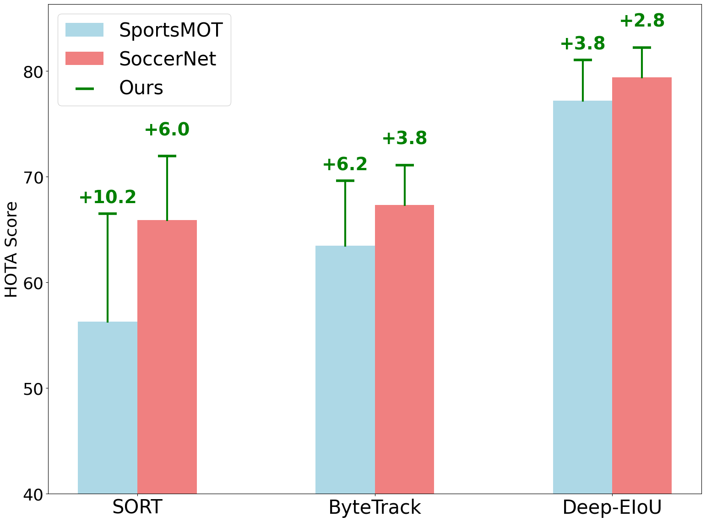

# GTA: Global Tracklet Association for Multi-Object Tracking in Sports

[](https://paperswithcode.com/sota/multi-object-tracking-on-sportsmot?p=gta-global-tracklet-association-for-multi)


🎉 Our work is accepted by [ACCV 2024 MLCSA Workshop](https://accv-mlcsa-2024.sunyai.com/index.html).

📄 Read the paper on [arXiv](https://arxiv.org/abs/2411.08216).

## Results on Datasets



## Demo
#### Soccer sequence, before (top) and after (bottom) applying global tracklet association:


#### Bastketball sequence, before (top) and after (bottom) applying global tracklet association:


#### SoccerNet Sequence: Before and After Correction

The following videos demonstrate the tracking performance on a SoccerNet sequence. Notice how the referee in the yellow jersey is correctly identified after applying the GTA refinement process.
### Before Correction
[View Before Correction Video](demo_media/116_DeepEIoU_baseline_clip.mp4)

### After 
[View Before Correction Video](demo_media/116_DeepEIoU_split_connect_clip.mp4)


## Introduction

This project introduces a universal, model-agnostic method designed to refine and enhance tracklet association for single-camera Multi-Object Tracking ([MOT](https://motchallenge.net/)). The method is primarily developed for datasets such as [SportsMOT](https://github.com/MCG-NJU/SportsMOT) or [SoccerNet](https://github.com/SoccerNet/sn-tracking) but is also applicable to any MOT datasets. The approach is developed as an offline post-processing tool.

## Methodology

Our method is model-agnostic, meaning it operates independently of the tracking models used to generate initial data. It only requires the tracking results from these models in text file MOT format and performs tracklet refinement through two main components: the tracklet splitter and the tracklet connector.

### Tracklet Splitter
<!-- TODO: add image to showcase a tracklet containing multiple identity -->
<!-- TODO: add clustering feature visualization -->

The tracklet splitter addresses the issue of impure tracklets that contain multiple identities. It utilizes unsupervised density-based spatial clustering, [DBSCAN](https://cdn.aaai.org/KDD/1996/KDD96-037.pdf), to cluster the instances within a tracklet based on their deep feature embeddings and to detect if there is an ID switch.

### Tracklet Connector

After the splitter processes the tracklets, the connector component iteratively merges tracklet pairs based on their averaged cosine distance between all tracklet instances' deep feature embeddings.

## Application

This refinement tool helps enhance tracking results from any tracker for an MOT task from any dataset. The tracklets are generated by the reid model, [OSNet](https://github.com/KaiyangZhou/deep-person-reid), which is trained on the SportsMOT dataset. You can also train and load your own reid model for tracklet generation. While the splitting and connecting components are train-free, there are parameters to tune for the clustering algorithms of both components.

## Installation

1. Clone the project repository:
   ```bash
    git clone https://github.com/sjc042/gta-link
    cd gta-link
    ```
3. Create a Python environment with version 3.8
    ```bash
    conda create -n gta_link python=3.8
    ```
4. Activate the environment
    ```bash
    conda activate gta_link
    ```
5. Install the required packages from requirements.txt
    ```bash
    pip install -r requirements.txt
    ```

6. Install [PyTorch](https://pytorch.org/get-started/locally/) (project tested on PyTorch 2.3.0 and CUDA 11.8, modify the command to match your CUDA version)
    ```bash
    pip install torch torchvision torchaudio
    ```

7. Install the torchreid model based on OSNet
   
    - Option 1:
    Use pip to install torchreid (1.4.0 as of 04/07/2025)
        ```bash
        pip install torchreid
        ```
    - Option 2:
    Open the reid folder and install torchreid (project tested on torchreid 1.4.0)
        ```bash
        cd reid
        python setup.py develop
        ```
    - Option 3:
    In project folder, creat folder 'reid', then clone torchreid repository to local machine for the newest version of torchreid
        ```bash
        cd gta-link
        mkdir reid
        git clone https://github.com/KaiyangZhou/deep-person-reid.git
        ```


## Prepare Dataset
1. To download SoccerNet tracking 2023, follow this [link](https://github.com/SoccerNet/sn-tracking?tab=readme-ov-file).
2. To download SportsMOT dataset, follow this [link](https://github.com/MCG-NJU/SportsMOT)

* Note: tracking data annotation format is in MOT and dataset organization follows MOT 17 challenge.


## Instructions for Running
NOTE:
Make sure to replace placeholders (e.g., `{}`) with actual values when running the commands.

1. Generate tracklets with your own tracking results:
    ```bash
    python generate_tracklets.py --model_path {reid model weight}
                                 --data_path {dataset directory}
                                 --pred_dir {tracking results direcotry}
                                 --tracker {tracker name}
    ```
    - `--model_path`: Specify the path to reid model's checkpoint file (default is `../reid_checkpoints/sports_model.pth.tar-60`)
    - `--data_path`: Specify directory of dataset's split data (e.g. `SoccerNet/tracking-2023/test`).
    - `--pred_dir`: Specify the directory containing the tracking results `.txt` files. The files should be organized as shown below:

        ```
        pred_dir (e.g., DeepEIoU_Baseline)
        ├── seq1.txt
        ├── seq2.txt
        ├── ...
        ```
    - `--tracker`: Indicate tracker's name for file saving.
    - Note: a video sequence's tracklets will be saved as  `.pkl` files in diretory parallel to `pred_dir` e.g.:
    
        ```
        ├──pred_dir (e.g., DeepEIoU_Baseline)

        ├──DeepEIoU_Tracklets_test
            ├── seq1.pkl
            ├── seq2.pkl
            ├── ...
        ```

2. Refine tracklets (in project root directory):
    ```bash
    python refine_tracklets.py --dataset {dataset name}
                     --tracker {tracker name}
                     --track_src {source directory of tracklet pkl files}
                     --use_split
                     --min_len 100
                     --eps 0.6
                     --min_samples 10
                     --max_k 3
                     --use_connect
                     --spatial_factor 1.0
                     --merge_dist_thres 0.4
    ```
    - `--dataset`: Specify the dataset name (e.g., SportsMOT, SoccerNet) for file saving.
    - `--tracker`: Specify the tracker name for file saving.
    - `--track_src`: Path to the directory containing the tracklet `.pkl` files.
    - `--use_split`: Include this flag to use the split component.
    - `--min_len`: Minimum length for a tracklet required for splitting (default is 100).
    - `--eps`: Maximum distance between two samples for DBSCAN clustering (default is 0.6).
    - `--min_samples`: Minimum number of samples in a neighborhood for a point to be considered a core point (default is 10).
    - `--max_k`: Maximum number of clusters/subtracklets to be output by the splitting component (default is 3).
    - `--use_connect`: Include this flag to use the connecting component.
    - `--spatial_factor`: Factor to adjust spatial constraints (default is 1.0).
    - `--merge_dist_thres`: Minimum cosine distance between two tracklets for merging (default is 0.4).

## Citation
If you use this code, please cite the following publication:
```bibtex
@inproceedings{sun2024gta,
  title={GTA: Global Tracklet Association for Multi-Object Tracking in Sports},
  author={Sun, Jiacheng and Huang, Hsiang-Wei and Yang, Cheng-Yen and Hwang, Jenq-Neng},
  booktitle = {Proceedings of the Asian Conference on Computer Vision},
  pages = {421-434},
  year={2024},
  publisher = {Springer}
}
```
